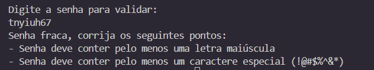

# ⋆｡‧˚ʚ🔐ɞ˚‧｡⋆ Validador de Força de Senhas

O **Validador de Força de Senhas** é um script em Ruby que ajuda você a verificar se suas senhas são seguras, garantindo que atendam a critérios básicos de segurança para proteger suas contas.

---

## ⋆˙⟡📸⋆˙⟡  Screenshots

---

## ⋆.˚✮🎧✮˚.⋆ Funcionalidades

✅ Verifica se a senha tem pelo menos 8 caracteres  
✅ Confirma presença de letras maiúsculas e minúsculas  
✅ Confirma presença de números  
✅ Confirma presença de caracteres especiais (`!@#$%^&*`)  
✅ Exibe mensagens claras sobre o que precisa ser melhorado  

---

## ˚.🎀༘⋆ Como usar

1. Clone ou baixe este repositório: git clone https://github.com/maryavila/validador-senha.git
  
2. Execute o script no terminal: ruby validador.rb

3. Digite a senha que deseja validar.

4. Veja o resultado da validação com dicas para melhorar sua senha.

---

## ‧₊ ᵎᵎ 🍒 ⋅ ˚✮ Tecnologias Utilizadas

💎 Ruby

💻 Terminal / CLI

---

## ⭒₊ ⊹🎀 Autor

Desenvolvido com 💻❤️ por Mary
